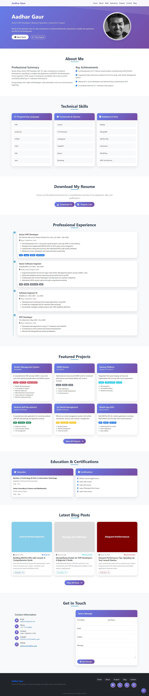
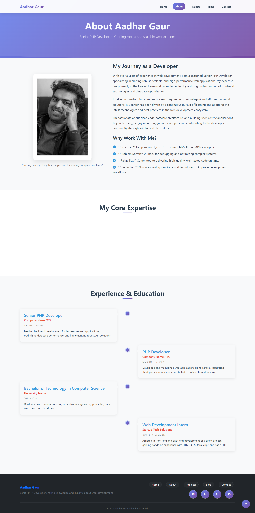
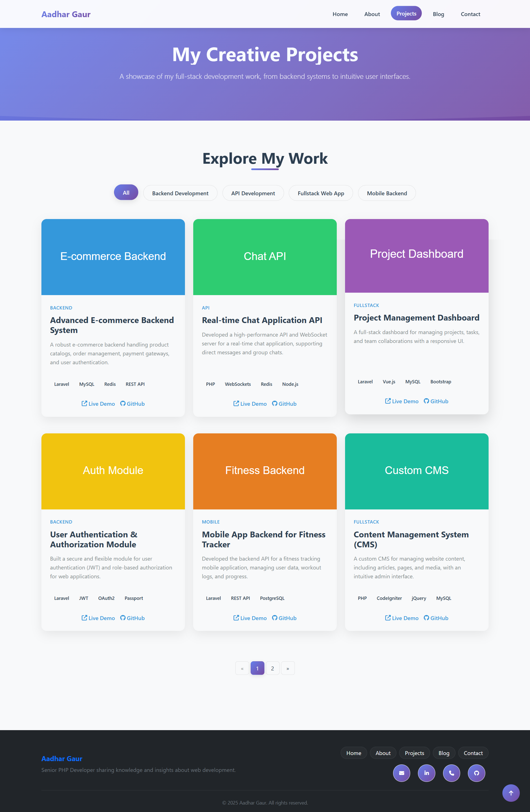
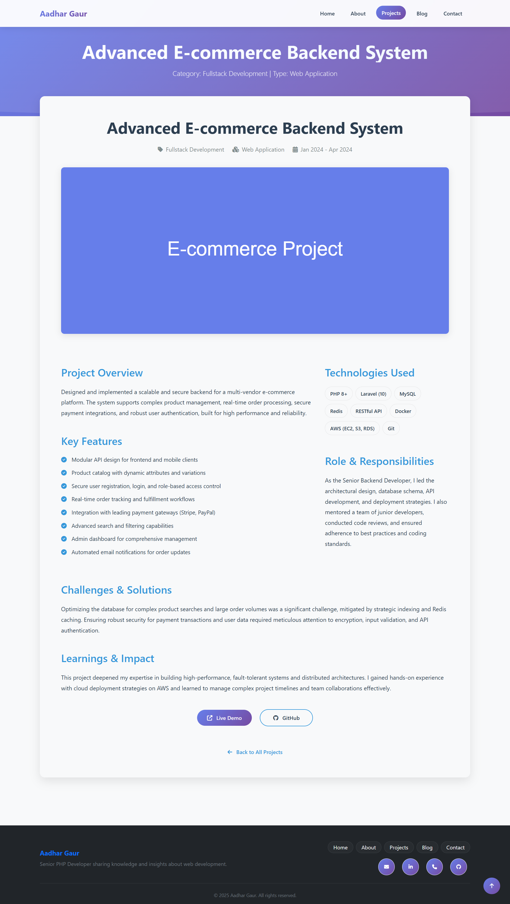
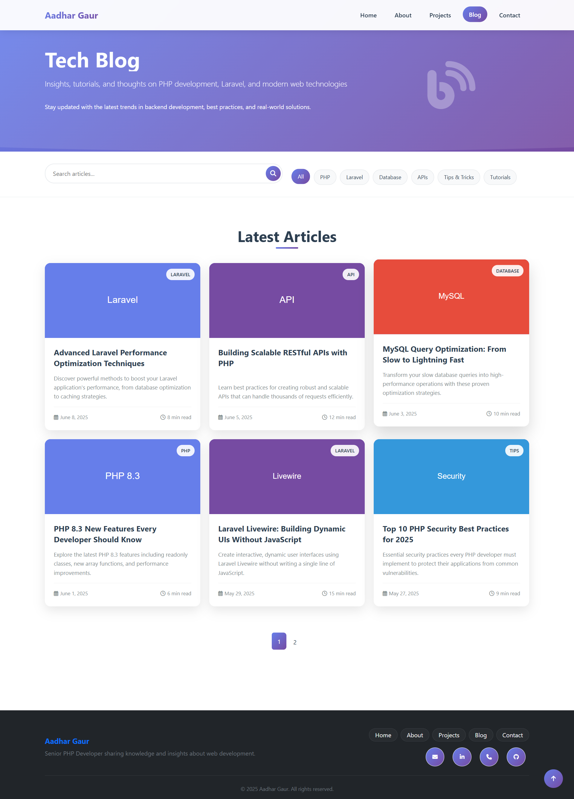
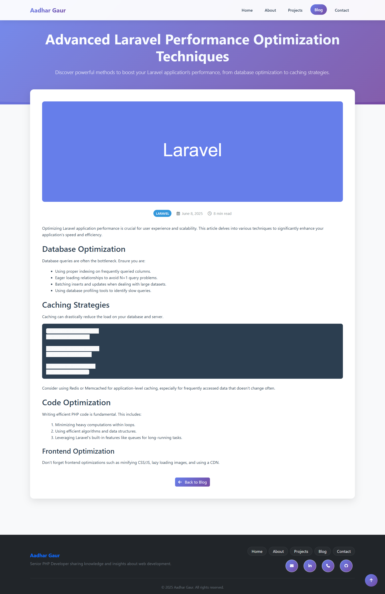
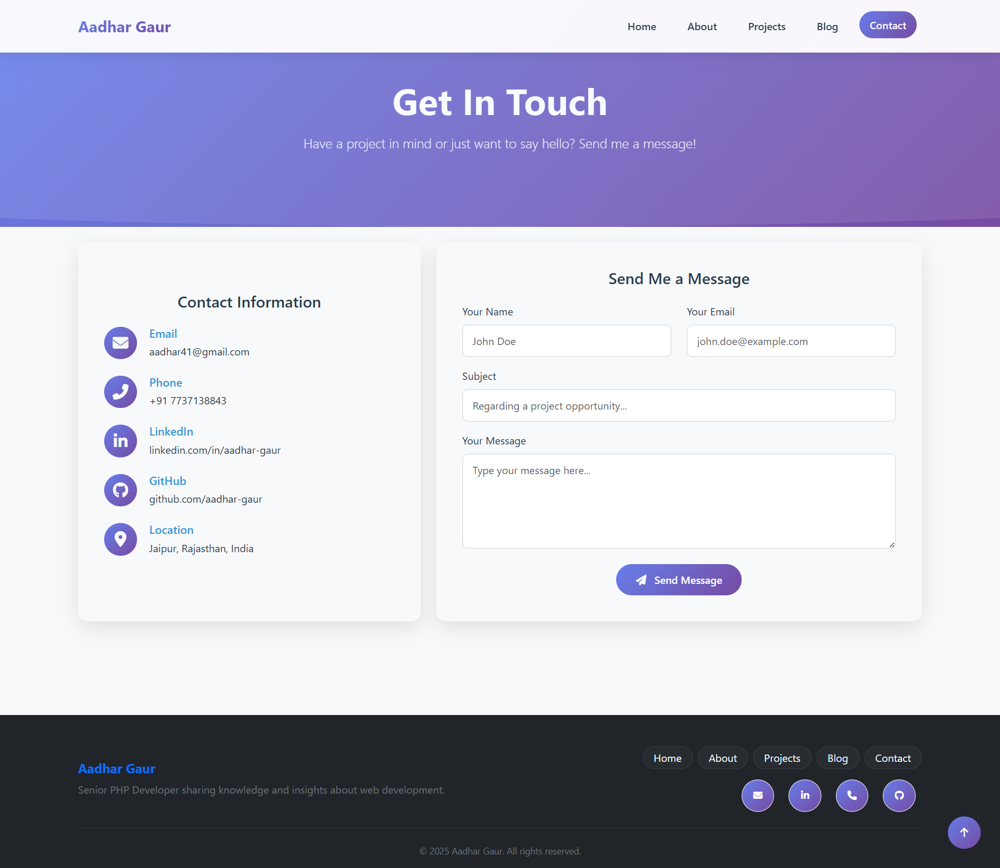

# Portfolio — Full Stack Application

A full-stack personal portfolio built with a **Laravel 12 REST API** backend and a **React + Vite** frontend, designed to match the [aadhar-portfolio](https://github.com/aadhar41/portfolio.git) HTML reference design.

---

## Screenshots

| Page | Preview |
|---|---|
| **Home** |  |
| **About** |  |
| **Projects** |  |
| **Project Detail** |  |
| **Blog** |  |
| **Blog Detail** |  |
| **Contact** |  |

---

## Project Structure


```
portfolio/
├── portfolio-backend/      # Laravel 12 REST API
├── portfolio-frontend/     # React + Vite SPA
├── documentation/          # Project documentation
├── .gitignore
└── README.md
```

---

## Tech Stack

### Backend (`portfolio-backend`)
| Layer | Technology |
|---|---|
| Framework | Laravel 12 |
| Language | PHP 8.2+ |
| Auth | Laravel Sanctum |
| Image Processing | Intervention Image 3 |
| Cache / Queue | Redis (Predis) |
| Testing | PHPUnit 11 |
| Dev Tools | Laravel Telescope, Pail, Pint, Sail |

### Frontend (`portfolio-frontend`)

| Layer | Technology |
|---|---|
| Framework | React 19 + Vite 7 |
| Routing | React Router DOM v7 |
| HTTP Client | Axios |
| Styling | Vanilla CSS (custom design system) |
| Icons | Font Awesome 6 |
| Fonts | Inter (Google Fonts) |
| SEO | react-helmet-async |

---

## Frontend Pages

| Route | Page | Description |
|---|---|---|
| `/` | Home | Full single-page portfolio with all sections (see Navigation below) |
| `/about` | About | Bio, skill icon grid, alternating two-column experience & education timeline |
| `/projects` | Projects | Category filter + search + project card grid |
| `/projects/:id` | ProjectDetail | Project image, description, tech stack, live/GitHub links |
| `/blog` | Blog | Search, tag filter pills, colored gradient blog cards, pagination |
| `/blog/:slug` | BlogDetail | HTML-rendered blog content with typography styles |
| `/contact` | Contact | Two-column: contact info icons + contact form card |


## Navigation


The main navbar scrolls to sections on the home page. All items use smooth scroll with a 70px offset for the fixed navbar.

| Nav Item | Target | Behaviour |
|---|---|---|
| Home | `#hero` | Scroll to hero section |
| About | `#about` | Scroll to About Me section |
| Skills | `#skills` | Scroll to Technical Skills section |
| Download CV | `#cv-download` | Scroll to CV download section |
| Experience | `#experience` | Scroll to Professional Experience section |
| Projects | `#projects` | Scroll to Featured Projects section |
| Education | `#education` | Scroll to Education & Certifications section |
| Blog | `#blog` | Scroll to Latest Blog Posts section |
| Contact | `#contact` | Scroll to Get In Touch section |

> When navigating from any other page, the header navigates to `/` first, then scrolls to the target section. The active nav item auto-highlights as the user scrolls.

---

## Frontend Design System

The frontend uses a custom vanilla CSS design system (`src/index.css`) matching the aadhar-portfolio reference:

- **Colors**: Primary `#2c3e50`, Secondary `#3498db`, Gradient `#667eea → #764ba2`
- **Components**: Navbar (frosted-glass), Hero, Cards (gradient headers), Timeline, Skill grid, Badges, Contact layout
- **Animations**: `fadeInUp`, `fadeInRight` keyframes on hero elements
- **Responsive**: Mobile hamburger menu (click-outside-to-close), adaptive grid columns
- **Blog content**: Full HTML typography — headings, code blocks, blockquotes, lists

---

## API Endpoints

### Public

| Method | Endpoint | Description |
|---|---|---|
| GET | `/api/v1/profile` | Full profile with skills, experiences, educations |
| GET | `/api/v1/skills` | All skills grouped by category |
| GET | `/api/v1/projects` | All projects (filter: `category`, `search`) |
| GET | `/api/v1/projects/{id}` | Single project |
| GET | `/api/v1/blogs` | Published blogs (filter: `tag`) |
| GET | `/api/v1/blogs/{slug}` | Single blog post by slug |
| POST | `/api/v1/contact` | Submit contact message |

### Admin (Sanctum protected)

| Method | Endpoint | Description |
|---|---|---|
| GET/POST | `/api/v1/admin/profile` | Upsert profile |
| POST | `/api/v1/admin/projects` | Create project |
| PUT/DELETE | `/api/v1/admin/projects/{id}` | Update/delete project |
| POST | `/api/v1/admin/blogs` | Create blog post |
| PUT/DELETE | `/api/v1/admin/blogs/{id}` | Update/delete blog post |
| GET | `/api/v1/admin/contacts` | List contact messages |
| PATCH | `/api/v1/admin/contacts/{id}/read` | Mark as read |
| DELETE | `/api/v1/admin/contacts/{id}` | Delete message |

---

## Database Schema

### `profiles`
Stores personal/professional profile information (name, title, bio, email, avatar, social links).

### `skills`

| Column | Type | Notes |
|---|---|---|
| name | string | Skill name |
| category | string | `frontend` \| `backend` \| `database` \| `tools` |
| level | integer | Proficiency 1–100 (default: 80) |
| sort_order | integer | Display ordering |

### `experiences`

| Column | Type | Notes |
|---|---|---|
| company | string | Employer name |
| position | string | Job title |
| description | text | Role description |
| start_date | string | Start date |
| end_date | string | nullable |
| is_current | boolean | Currently working here |
| technologies | json | nullable — tech used |

### `educations`

| Column | Type | Notes |
|---|---|---|
| institution | string | School/University |
| degree | string | Degree title |
| field_of_study | string | Major/Specialization |
| start_year | string | Start year |
| end_year | string | nullable |
| grade | string | nullable |

### `projects`

| Column | Type | Notes |
|---|---|---|
| title | string | Project name |
| description | text | Short description |
| long_description | longText | nullable |
| image | string | nullable — cover image path |
| live_url | string | nullable |
| github_url | string | nullable |
| technologies | json | Tech stack |
| category | string | `web` \| `mobile` \| `api` |
| featured | boolean | Highlight on homepage |
| sort_order | integer | Display ordering |

### `blogs`

| Column | Type | Notes |
|---|---|---|
| title | string | Post title |
| slug | string | unique — URL-friendly key |
| excerpt | text | Short preview |
| content | longText | Full post (supports HTML) |
| cover_image | string | nullable |
| tags | json | nullable |
| status | enum | `draft` \| `published` |
| published_at | timestamp | nullable |
| read_time | integer | Estimated minutes (default: 5) |

### `contacts`
| Column | Type | Notes |
|---|---|---|
| name | string | Sender name |
| email | string | Sender email |
| subject | string | nullable |
| message | text | Message body |
| is_read | boolean | Read status (default: false) |

### `settings`
Global application settings stored as key–value pairs with type, section, label, visibility, and soft-delete support.

---

## Getting Started

### Prerequisites
- PHP 8.2+
- Composer
- Node.js 18+ & npm
- MySQL / PostgreSQL
- Redis

### Backend Setup

```bash
cd portfolio-backend

# Install dependencies
composer install

# Copy and configure environment
cp .env.example .env
php artisan key:generate

# Set DB credentials in .env, then run migrations & seed
php artisan migrate --seed
```

### Frontend Setup

```bash
cd portfolio-frontend

# Install dependencies
npm install

# Copy and configure environment
cp .env.example .env
# Set VITE_API_URL=http://localhost:8000/api/v1
```

### Running Locally

```bash
# Backend (from portfolio-backend/)
composer run dev
# API available at http://localhost:8000

# Frontend (from portfolio-frontend/)
npm run dev
# App available at http://localhost:3000
```

### Running Backend Tests

```bash
cd portfolio-backend
composer run test
```

---

## Environment Variables

### Backend (`.env`)
```env
APP_URL=http://localhost:8000
FRONTEND_URL=http://localhost:3000

DB_CONNECTION=mysql
DB_DATABASE=portfolio

CACHE_DRIVER=redis
QUEUE_CONNECTION=redis
```

### Frontend (`.env`)
```env
VITE_API_URL=http://localhost:8000/api/v1
```

---

## API Authentication

This project uses **Laravel Sanctum** for token-based API authentication on all admin endpoints.

---

## Recent Stability Improvements

The following issues were recently addressed to ensure a seamless admin experience:
- **API Resolution**: Fixed a 404 error on the `admin/upload` endpoint by standardizing path resolution in the frontend.
- **ReferenceErrors**: Resolved state initialization bugs in Skill, Education, and Experience management pages.
- **UI Visibility**: Improved the Profile Management layout to ensure all form fields and action buttons are fully visible and scrollable.

---

## CORS

The backend allows cross-origin requests from the `FRONTEND_URL` defined in `.env`. Configured in `config/cors.php`.

---

## License

This project is open-sourced under the [MIT license](https://opensource.org/licenses/MIT).
